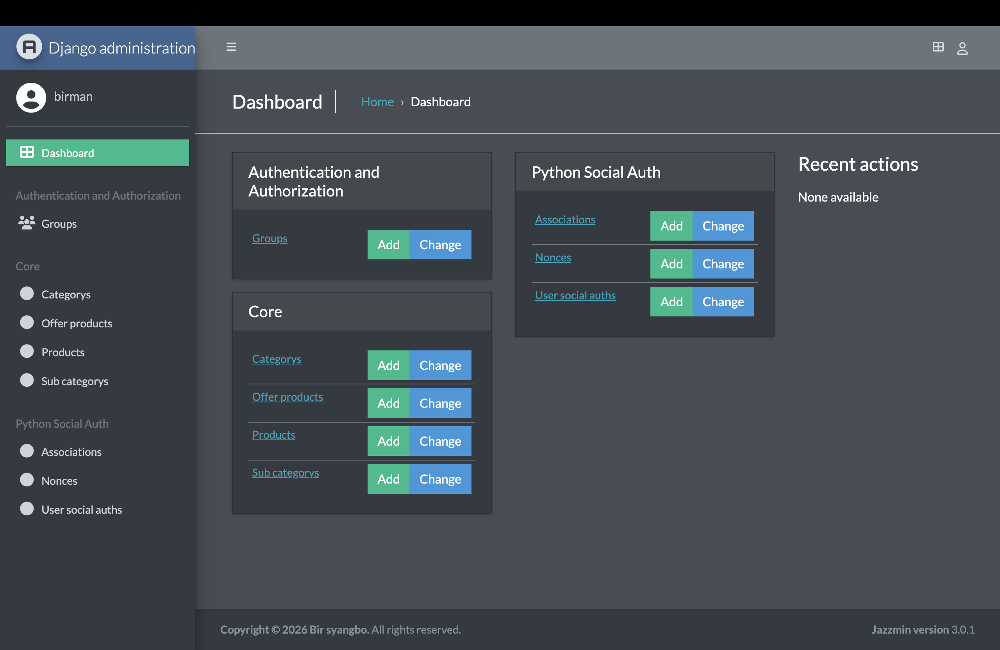
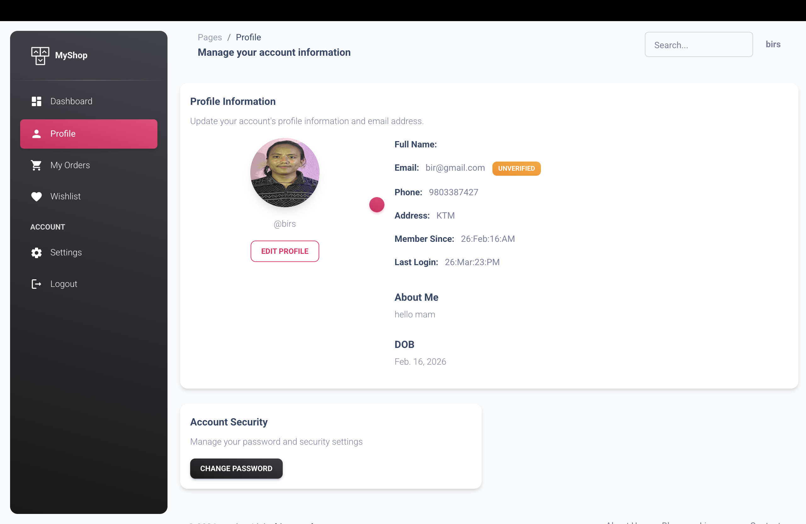
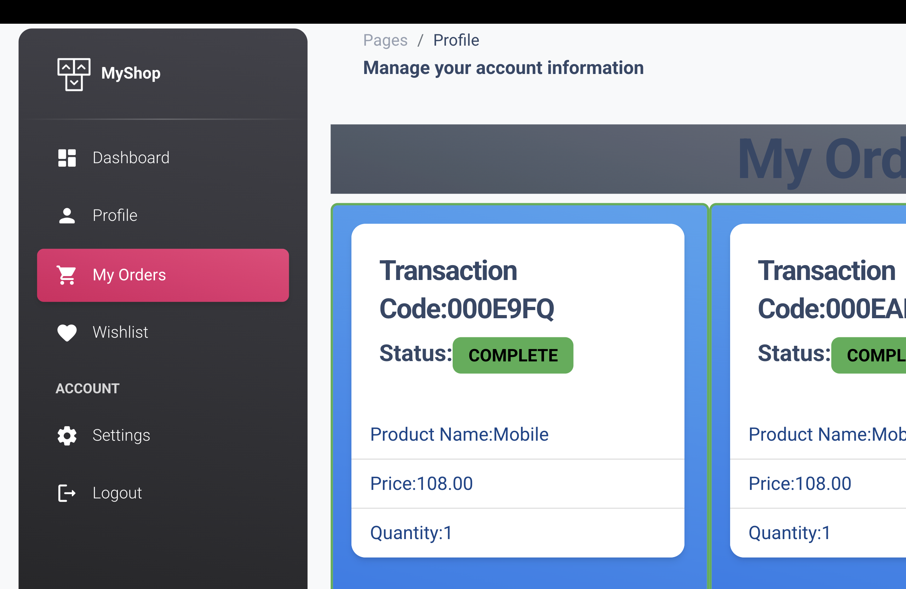
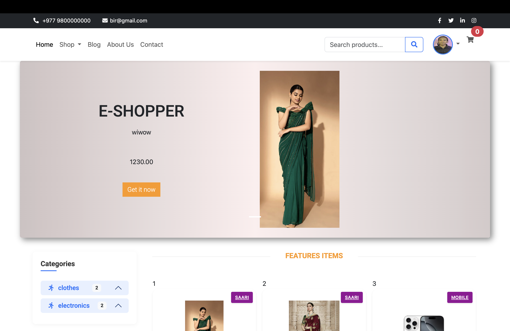
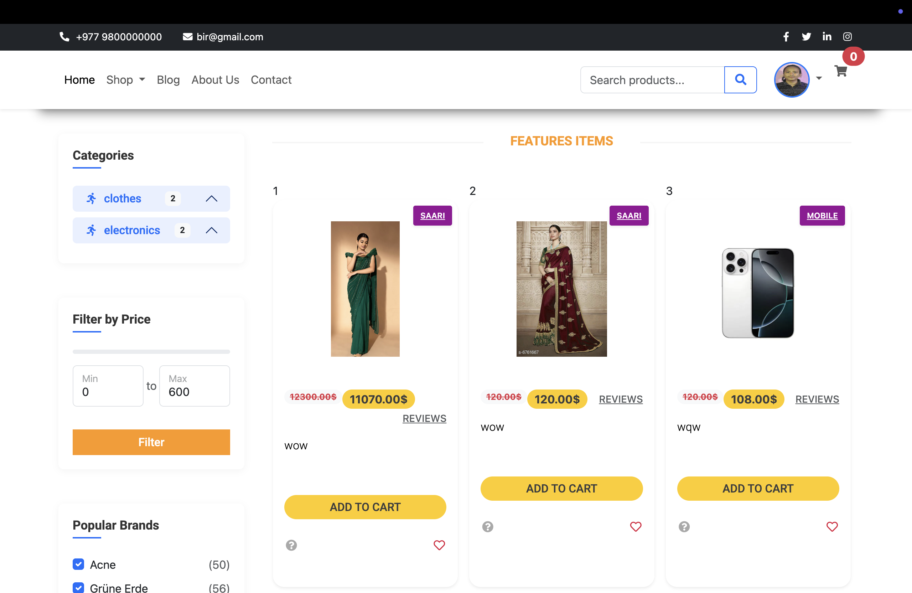
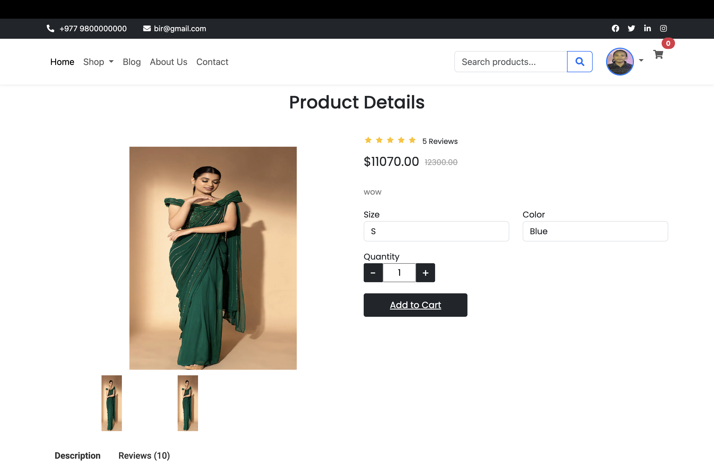
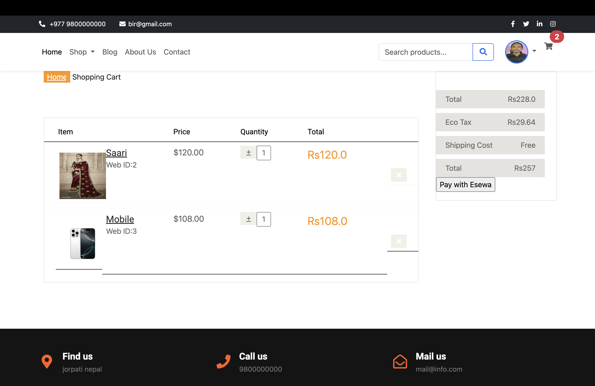
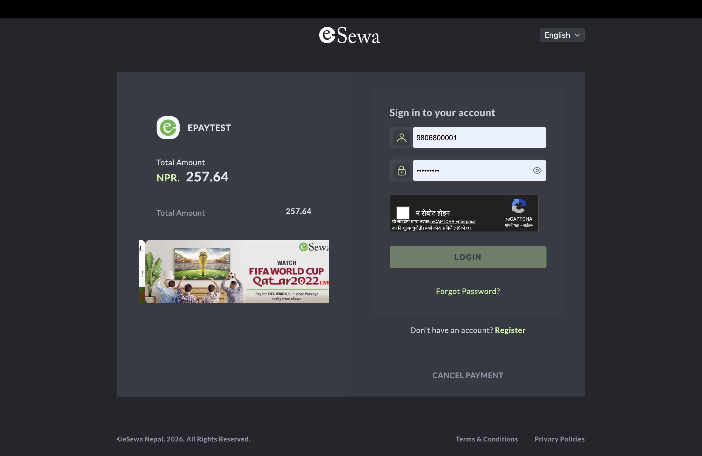
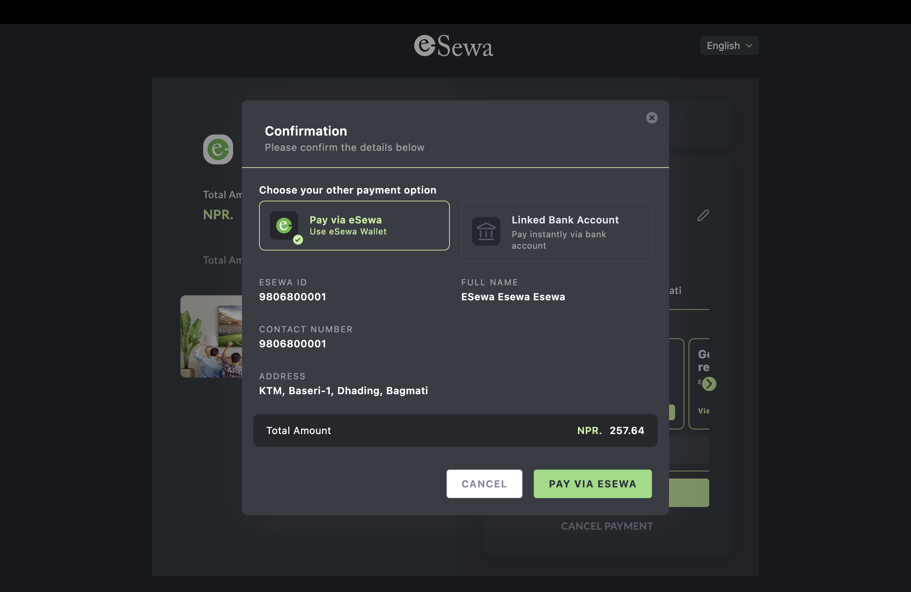
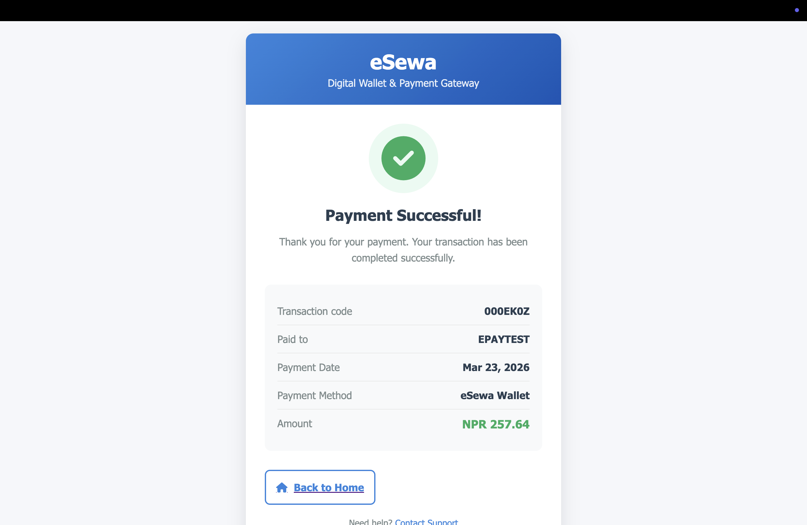

# MyShop - Django E-commerce Platform

A full-stack E-commerce application built with **Django**, featuring a modern UI, user authentication, a robust product management system, and integrated **eSewa** payment gateway.

## Project Gallery

### Administrative & User Dashboards
| Django Admin (Jazzmin) | User Profile | My Orders |
|---|---|---|
|  |  |  |

### Shopping Experience
| Home / Offers | Product Listing | Product Details |
|---|---|---|
|  |  |  |

### Checkout & eSewa Payment Flow
| Shopping Cart | eSewa Login | Payment Confirmation | Success Page |
|---|---|---|---|
|  |  |  |  |

---

## Features

- **Full-Stack Django:** Robust backend with custom models for Products, Categories, and Orders.
- **E-Sewa Integration:** Secure payment processing for users in Nepal.
- **Modern UI:** Responsive design using Bootstrap and "Material Dashboard" for user profiles.
- **User Management:** Custom user profiles, order history tracking, and secure authentication.
- **Product Management:** Search, filter by price, and detailed product views with review systems.

## Tech Stack

- **Backend:** Python, Django
- **Frontend:** HTML,Bootstrap,CSS
- **Database:** SQLite (Development)
- **Payment:** eSewa 
- **Admin Theme:** Jazzmin

## Installation & Setup

1. **Clone the repository:**
   ```bash
   git clone [https://github.com/birsyangbo/ecommerce.git](https://github.com/birsyangbo/ecommerce.git)
   cd ecommerce
